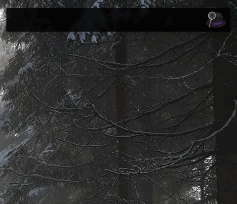

# React Docs Workflow for Alfred


Search the [React documentation](https://reactjs.org/docs/getting-started.html) using [Alfred](https://www.alfredapp.com/).



## Installation

1. [Download the latest version](https://github.com/techouse/alfred-react-docs/releases/latest)
2. Install the workflow by double-clicking the `.alfredworkflow` file
3. You can add the workflow to a category, then click "Import" to finish importing. You'll now see the workflow listed in the left sidebar of your Workflows preferences pane.

## Usage

Just type `rjs` followed by your search query.

```
rjs state
```

Either press `⌘Y` to Quick Look the result, or press `<enter>` to open it in your web browser.

### Note

The lightning fast search is powered by [Algolia](https://www.algolia.com) using the _same_ index as the official [React](https://react.dev/learn) website.